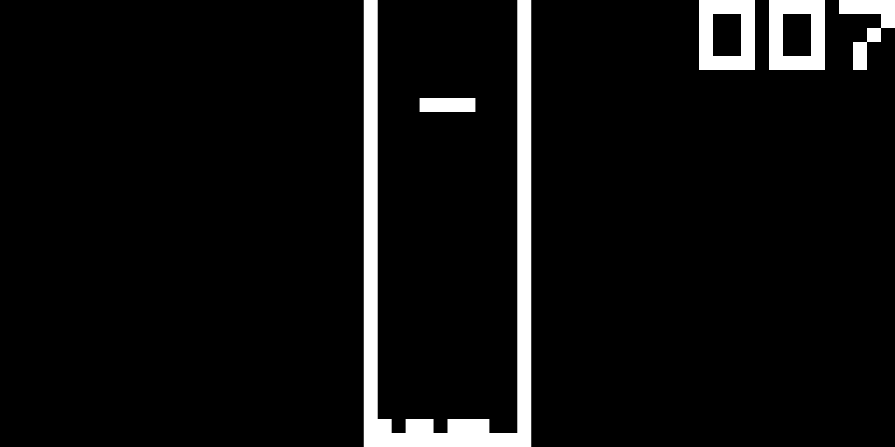

# chippy8

A simple CHIP8 emulator. Works with all tested games, although sound output is not
implemented (Sound timer is present and working though).

Uses Tetra for graphics.

### Images




### Build/Run

``` bash
# Build as release
cargo build --release
```

### Code style

Follow the style used by rustfmt.